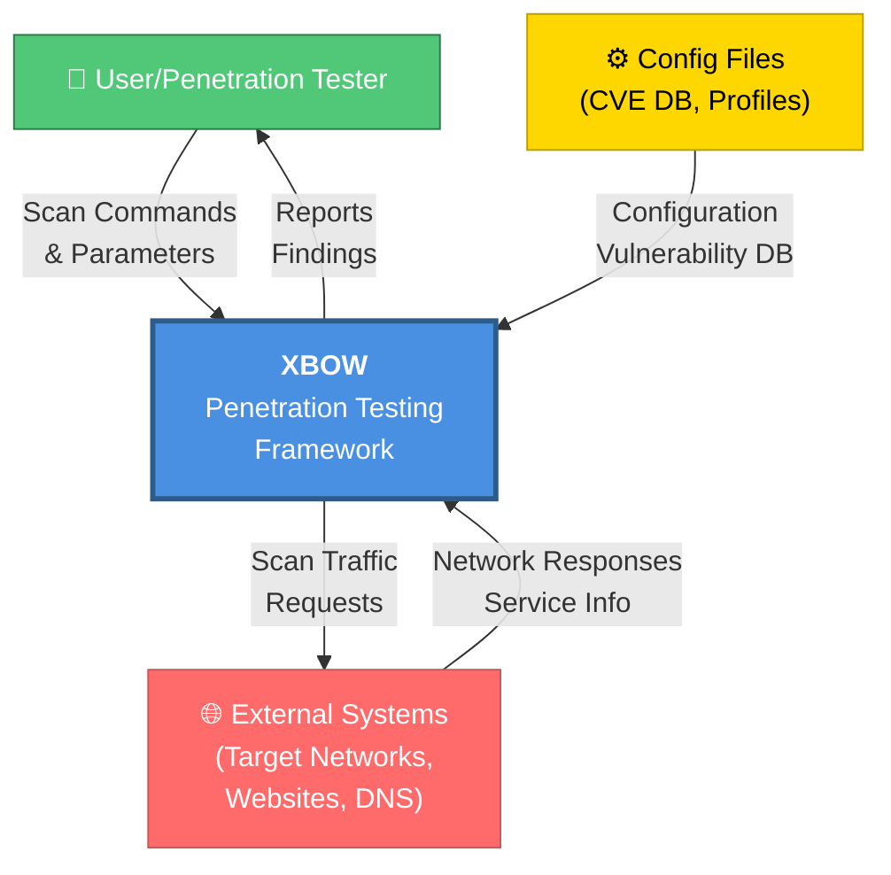
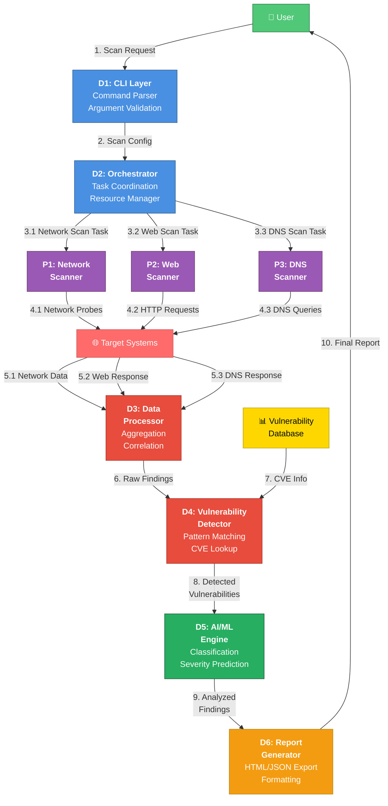
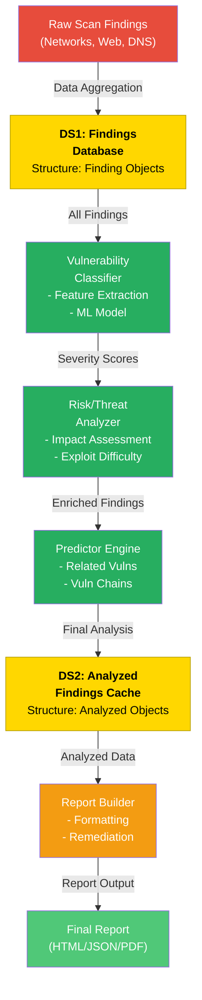
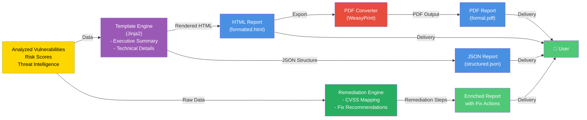
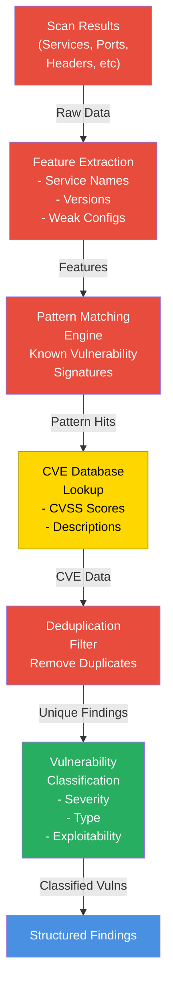
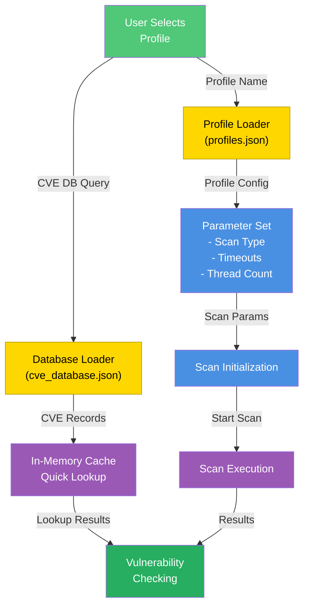

# XBOW Data Flow Diagrams (DFD)

## Overview
This document contains Data Flow Diagrams at multiple levels of abstraction for the XBOW AI Penetration Testing Tool.

---

## Level 0: Context Diagram (System Boundary)

### Level 0 Description
- **Input**: User commands, external system responses, configuration data
- **Processing**: XBOW system (black box at this level)
- **Output**: Security reports and scan findings
- **External Entities**: Users, Target systems, Configuration sources

---

## Level 1: System-Level Data Flows

### Level 1 Description

| Component | Data Flow | Purpose |
|-----------|-----------|---------|
| **D1: CLI** | Accepts user commands, validates arguments | Command interface |
| **D2: Orchestrator** | Routes tasks to appropriate scanners | Coordinates scanning |
| **P1-P3: Scanners** | Execute parallel scans against target | Network/Web/DNS enumeration |
| **D3: Data Processor** | Aggregates scan results | Data consolidation |
| **D4: Vulnerability Detector** | Matches findings to known vulnerabilities | Vulnerability identification |
| **D5: AI/ML Engine** | Classifies and predicts severity | Intelligence analysis |
| **D6: Report Generator** | Formats results into reports | Output generation |

**Data Stores:**
- **VulnDB**: CVE database and vulnerability signatures

---

## Level 2: Detailed Data Flows

### 2A: Network Scanning Data Flow

```mermaid
graph LR
    User["👤 User Command:<br/>scan --target 192.168.1.0/24"]
    
    User -->|Target CIDR| Parser["Parse Target<br/>& Options"]
    Parser -->|IP List| PingSweep["Ping Sweep<br/>(Host Discovery)"]
    
    PingSweep -->|Active Hosts| PortScan["Port Scanning<br/>(TCP/UDP)"]
    PortScan -->|Open Ports| ServiceID["Service<br/>Identification<br/>(Banner Grab)"]
    ServiceID -->|Services & Versions| OSDetect["OS Fingerprint<br/>Detection"]
    
    OSDetect -->|Raw Scan Data| VulnMatch["Vulnerability<br/>Pattern Match"]
    VulnMatch -->|Findings| Output["Network Scan<br/>Results"]
    
    style Parser fill:#4A90E2,color:#fff
    style PingSweep fill:#9B59B6,color:#fff
    style PortScan fill:#9B59B6,color:#fff
    style ServiceID fill:#9B59B6,color:#fff
    style OSDetect fill:#9B59B6,color:#fff
    style VulnMatch fill:#E74C3C,color:#fff
    style Output fill:#F39C12,color:#fff
```

### 2B: Web Application Scanning Data Flow

```mermaid
graph LR
    User["👤 User Command:<br/>scan --target https://example.com"]
    
    User -->|URL| Parser["Parse URL<br/>& Options"]
    Parser -->|Target URL| SSLCheck["SSL/TLS<br/>Analysis"]
    
    SSLCheck -->|Certificate Data| HeaderScan["Security Header<br/>Analysis"]
    HeaderScan -->|Headers| PathScan["Common Path<br/>Discovery"]
    
    PathScan -->|Paths Found| InjectionTest["Injection Point<br/>Testing<br/>(SQLi, XSS, etc)"]
    InjectionTest -->|Injection Results| CrawlSite["Website<br/>Crawling<br/>(Link Discovery)"]
    
    CrawlSite -->|Pages & Endpoints| CacheCheck["Cache Security<br/>Analysis"]
    CacheCheck -->|Web Findings| VulnMatch["Vulnerability<br/>Correlation"]
    
    VulnMatch -->|Web Scan Results| Output["Web Assessment<br/>Report"]
    
    style Parser fill:#4A90E2,color:#fff
    style SSLCheck fill:#9B59B6,color:#fff
    style HeaderScan fill:#9B59B6,color:#fff
    style PathScan fill:#9B59B6,color:#fff
    style InjectionTest fill:#9B59B6,color:#fff
    style CrawlSite fill:#9B59B6,color:#fff
    style CacheCheck fill:#9B59B6,color:#fff
    style VulnMatch fill:#E74C3C,color:#fff
    style Output fill:#F39C12,color:#fff
```

### 2C: DNS Enumeration Data Flow

```mermaid
graph LR
    User["👤 User Command:<br/>scan --target example.com --dns"]
    
    User -->|Domain Name| Parser["Parse Domain<br/>& Options"]
    Parser -->|Domain| RecordEnum["Enumerate DNS<br/>Records<br/>(A,AAAA,MX,NS,TXT)"]
    
    RecordEnum -->|DNS Records| SubdomainEnum["Subdomain<br/>Discovery<br/>(Wordlist)"]
    SubdomainEnum -->|Subdomains| ZoneTransfer["Zone Transfer<br/>Attempt"]
    
    ZoneTransfer -->|Zone Data/Failure| RevDNS["Reverse DNS<br/>Lookup"]
    RevDNS -->|Hostnames| DNSSecurity["DNSSEC<br/>Validation"]
    
    DNSSecurity -->|DNS Findings| VulnMatch["Vulnerability<br/>Analysis"]
    VulnMatch -->|DNS Results| Output["DNS Reconnaissance<br/>Report"]
    
    style Parser fill:#4A90E2,color:#fff
    style RecordEnum fill:#9B59B6,color:#fff
    style SubdomainEnum fill:#9B59B6,color:#fff
    style ZoneTransfer fill:#9B59B6,color:#fff
    style RevDNS fill:#9B59B6,color:#fff
    style DNSSecurity fill:#9B59B6,color:#fff
    style VulnMatch fill:#E74C3C,color:#fff
    style Output fill:#F39C12,color:#fff
```

### 2D: Data Analysis & AI Processing Flow

### 2E: Report Generation & Output Flow

---

## Level 2 (Continued): Advanced Processing Flows

### 2F: Vulnerability Detection & Matching Flow

### 2G: Configuration & Profile Management Flow

---

## Data Flow Summary Table

| Data Flow ID | Source | Destination | Data Type | Volume | Frequency |
|-------------|--------|-------------|-----------|--------|-----------|
| 1.1 | User | CLI | Command strings | Low | On-demand |
| 1.2 | CLI | Orchestrator | Config objects | Low | Per scan |
| 2.1 | Orchestrator | Scanners (N/W,Web,DNS) | Task objects | Medium | Per scan |
| 3.1 | Network Scanner | Target Systems | ICMP/TCP packets | High | Parallel |
| 3.2 | Web Scanner | Target Systems | HTTP requests | High | Parallel |
| 3.3 | DNS Scanner | Target Systems | DNS queries | Medium | Sequential |
| 4.1 | Target Systems | Scanners | Response data | High | Streaming |
| 5.1 | Scanners | Data Processor | Raw findings | High | Batch |
| 6.1 | Data Processor | Vulnerability Detector | Structured data | High | Batch |
| 7.1 | Vulnerability Detector | AI/ML Engine | Classified findings | High | Batch |
| 8.1 | AI/ML Engine | Report Generator | Analyzed data | High | Batch |
| 9.1 | Report Generator | User | Reports (HTML/JSON/PDF) | Medium | On-demand |
| 10.1 | Config DB | All Processors | Configuration/CVE data | Low | At startup |

---

## Data Stores

| Store ID | Store Name | Data Structure | Update Frequency | Access Pattern |
|----------|-----------|-----------------|------------------|-----------------|
| DS1 | Findings DB | JSON/In-Memory | Real-time | Read/Write |
| DS2 | Analyzed Cache | JSON/In-Memory | Per scan | Read/Write |
| DS3 | CVE Database | JSON file | On-demand | Read-only |
| DS4 | Profiles | JSON file | Rarely | Read-only |
| DS5 | Scan Logs | Log files | Real-time | Append |
| DS6 | Reports | HTML/JSON/PDF files | Per scan | Write-only |

---

## Process Descriptions (Data Dictionary)

### Processes

**P1: Network Scanner**
- Performs ICMP ping, TCP port scanning, service detection
- Input: Target IPs, port ranges, scan parameters
- Output: Open ports, service names, versions, OS info

**P2: Web Scanner**
- Tests HTTP/HTTPS endpoints for vulnerabilities
- Input: URL, paths, injection payloads
- Output: Headers, vulnerable endpoints, SSL info

**P3: DNS Scanner**
- Enumerates DNS records, finds subdomains
- Input: Domain name
- Output: A/AAAA/MX/NS records, subdomains, zone info

**P4: Data Processor**
- Aggregates results from all scanners
- Input: Individual scan results
- Output: Consolidated findings

**P5: Vulnerability Detector**
- Matches findings to known vulnerabilities
- Input: Consolidated findings, CVE database
- Output: Identified CVEs and vulnerabilities

**P6: AI/ML Engine**
- Classifies severity and predicts related vulnerabilities
- Input: Identified vulnerabilities with context
- Output: Risk scores, severity ratings, related vulns

**P7: Report Generator**
- Formats results into human-readable reports
- Input: Analyzed findings, templates
- Output: HTML/JSON/PDF reports with recommendations

---

## External Entities

| Entity | Role | Interaction |
|--------|------|-------------|
| **User/Pentester** | Initiator | Provides commands, receives reports |
| **Target Systems** | Subject | Responds to scan probes |
| **CVE Database** | Reference | Provides vulnerability signatures |
| **Configuration Files** | Reference | Provides scan profiles and settings |
| **Logging System** | Archive | Records all activities |

---

## Key Data Flow Characteristics

### Volume & Performance
- **High-volume flows**: Network scanning results (3.1-4.1), batch processing (5.1-8.1)
- **Low-volume flows**: User commands (1.1), configuration (1.2, 10.1)
- **Streaming vs. Batch**: Scanners stream results → aggregation → batch processing → reporting

### Security Considerations
- Configuration files contain sensitive profiles
- Scan results contain discovered vulnerabilities
- Reports exported with appropriate sanitization
- Audit logs maintained for compliance

### Error Handling
- Failed scans: Retry logic with exponential backoff
- Malformed responses: Validation at each stage
- Missing data: Graceful degradation with warnings

