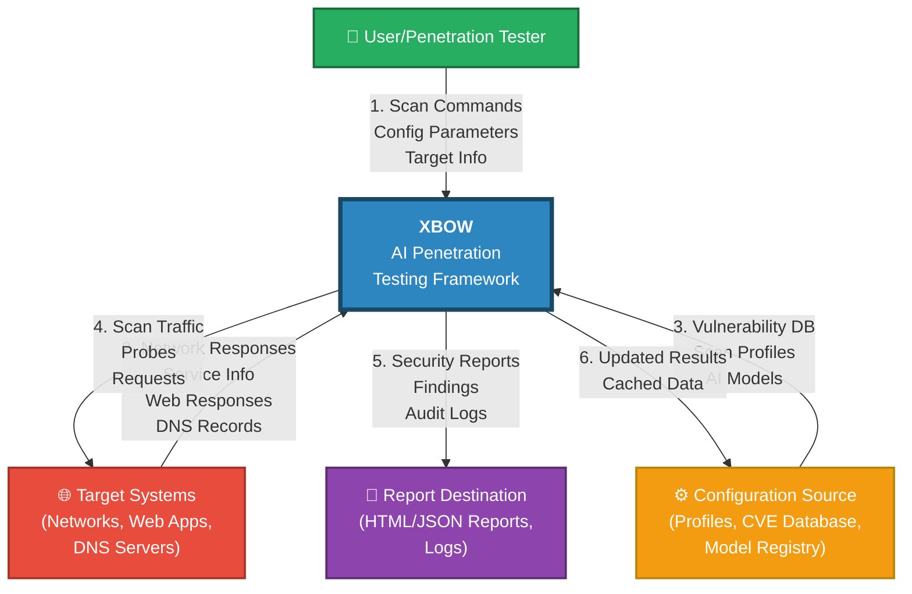
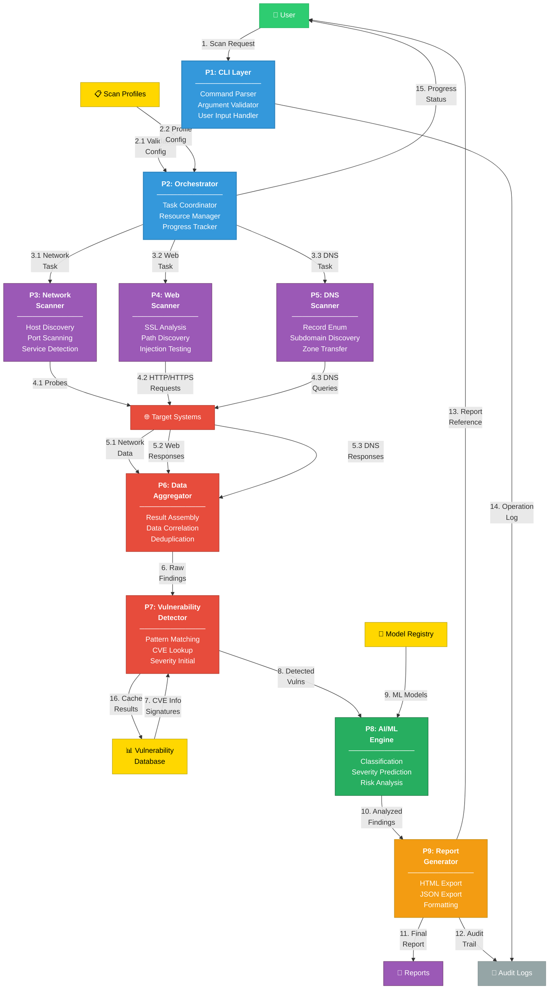

# XBOW Data Flow Diagrams - Level 0 and Level 1

## Table of Contents
1. [Level 0: Context Diagram](#level-0-context-diagram)
2. [Level 1: System-Level Data Flow](#level-1-system-level-data-flow)
3. [Data Flow Dictionary](#data-flow-dictionary)
4. [Process Descriptions](#process-descriptions)

---

## Level 0: Context Diagram

### Overview
The Context Diagram (Level 0 DFD) represents the entire XBOW system as a single process, showing all interactions with external entities and data sources.

### Mermaid Diagram


### Level 0 Components

| Entity | Type | Description |
|--------|------|-------------|
| **User/Penetration Tester** | External Entity | Initiates scans and receives reports |
| **Target Systems** | External Entity | Networks, web applications, DNS servers being tested |
| **Configuration Source** | External Data Store | CVE database, scan profiles, AI models |
| **Report Destination** | External Data Store | Location where reports and logs are stored |
| **XBOW Framework** | System | Main process (black box at this level) |

### Level 0 Data Flows

| Flow # | From | To | Data | Description |
|--------|------|----|----|-------------|
| 1 | User | XBOW | Scan commands, parameters, target info | User requests specific scans with parameters |
| 2 | Target Systems | XBOW | Network responses, service info, web responses | System collects responses from target |
| 3 | Configuration Source | XBOW | Vulnerability DB, profiles, AI models | System loads necessary configuration |
| 4 | XBOW | Target Systems | Scan traffic, probes, HTTP requests | System actively probes target systems |
| 5 | XBOW | Report Destination | Reports, findings, logs | System outputs results and audit trails |
| 6 | XBOW | Configuration Source | Updated results, cached data | System stores results and cache |

---

## Level 1: System-Level Data Flow

### Overview
Level 1 DFD decomposes the XBOW system into major functional processes, showing how data flows between them and with external entities.

### Mermaid Diagram


### Level 1 Components

#### Processes (P)

| Process | ID | Type | Description |
|---------|----|----|-------------|
| **CLI Layer** | P1 | Interface | Accepts user commands and validates parameters |
| **Orchestrator** | P2 | Controller | Coordinates and manages all scanning tasks |
| **Network Scanner** | P3 | Scanner | Executes network-based reconnaissance |
| **Web Scanner** | P4 | Scanner | Executes web application testing |
| **DNS Scanner** | P5 | Scanner | Executes DNS enumeration and reconnaissance |
| **Data Aggregator** | P6 | Processor | Consolidates and correlates scan results |
| **Vulnerability Detector** | P7 | Analyzer | Identifies and matches known vulnerabilities |
| **AI/ML Engine** | P8 | Analyzer | Classifies, predicts severity, analyzes risk |
| **Report Generator** | P9 | Output | Formats findings into reports |

#### Data Stores (D)

| Store | ID | Type | Description |
|-------|----|----|-------------|
| **Vulnerability Database** | D1 | External | CVE database and vulnerability signatures |
| **Scan Profiles** | D2 | External | Predefined and custom scan configurations |
| **Model Registry** | D3 | External | Trained ML models for classification |
| **Report Destination** | D4 | External | Output location for reports (HTML/JSON) |
| **Audit Logs** | D5 | External | Operation logs and audit trails |

#### External Entities (E)

| Entity | ID | Description |
|--------|----|----|
| **User/Penetration Tester** | E1 | Initiates scans and consumes reports |
| **Target Systems** | E2 | Networks, web apps, DNS servers being tested |

### Level 1 Data Flows

| # | Process/Flow | Description | Data Content |
|---|--------------|-------------|-----------------|
| 1 | User → P1 | User submits scan command | Command, target, options |
| 2.1 | P1 → P2 | Validated configuration | Parsed parameters, target info |
| 2.2 | D2 → P2 | Profile data retrieved | Scan profile settings |
| 3.1 | P2 → P3 | Network scan task | Target, scan depth, timeout |
| 3.2 | P2 → P4 | Web scan task | URL, scan type, plugins |
| 3.3 | P2 → P5 | DNS scan task | Domain, record types |
| 4.1 | P3 → E2 | Network probes | Ping requests, port scans |
| 4.2 | P4 → E2 | HTTP requests | GET/POST requests, payloads |
| 4.3 | P5 → E2 | DNS queries | DNS lookups, zone transfer attempts |
| 5.1 | E2 → P6 | Network responses | Host data, open ports, services |
| 5.2 | E2 → P6 | Web responses | HTML, headers, response codes |
| 5.3 | E2 → P6 | DNS responses | DNS records, zone data |
| 6 | P6 → P7 | Aggregated findings | Consolidated raw data |
| 7 | D1 → P7 | Vulnerability data | CVE records, signatures |
| 8 | P7 → P8 | Detected vulnerabilities | Vuln list with initial severity |
| 9 | D3 → P8 | ML models | Pre-trained classification models |
| 10 | P8 → P9 | Analyzed findings | Enriched vuln data with predictions |
| 11 | P9 → D4 | Final reports | HTML/JSON formatted reports |
| 12 | P9 → D5 | Audit trail | Operation logs, timestamps |
| 13 | P9 → E1 | Report delivery | Reports and findings |
| 14 | P1 → D5 | Command logs | User commands, arguments |
| 15 | P2 → E1 | Progress updates | Scan status, ETA |
| 16 | P7 → D1 | Cache results | Update vulnerability cache |

---

## Data Flow Dictionary

### Data Elements by Flow

#### Command Flow (Flows 1-2.2)
```
Scan Request:
├─ Command: string (scan, pentest, profile, etc.)
├─ Target: string (IP, CIDR, domain, URL)
├─ ScanType: enum (network, web, dns, full)
├─ Profile: string (aggressive, default, stealth)
├─ Options: object
│  ├─ Timeout: integer (seconds)
│  ├─ Threads: integer (parallel workers)
│  ├─ Ports: string (port range)
│  └─ Plugins: array (enabled plugins)
└─ Timestamp: datetime
```

#### Scanning Flows (Flows 3-5)
```
Network Data:
├─ Host: string (IP address)
├─ Status: enum (up, down)
├─ OpenPorts: array
│  └─ Port: object
│     ├─ Number: integer
│     ├─ State: enum (open, filtered, closed)
│     ├─ Service: string
│     └─ Version: string
└─ OSFingerprint: object

Web Response:
├─ URL: string
├─ StatusCode: integer
├─ Headers: object
├─ SSL: object
│  ├─ Issuer: string
│  ├─ ExpiryDate: datetime
│  └─ Vulnerabilities: array
├─ Content: string (HTML body)
└─ ResponseTime: integer (ms)

DNS Response:
├─ Domain: string
├─ Records: array
│  └─ Record: object
│     ├─ Type: enum (A, AAAA, MX, NS, TXT, etc.)
│     ├─ Value: string
│     └─ TTL: integer
└─ Metadata: object
```

#### Analysis Flows (Flows 6-10)
```
Raw Finding:
├─ Source: enum (network, web, dns)
├─ Target: string
├─ Data: object (varies by source)
└─ Timestamp: datetime

Detected Vulnerability:
├─ CVE_ID: string
├─ Title: string
├─ Description: string
├─ Severity: enum (critical, high, medium, low)
├─ CVSS_Score: float
├─ AffectedService: string
└─ Remediation: string

Analyzed Finding:
├─ VulnerabilityID: string
├─ ML_Confidence: float [0-1]
├─ PredictedSeverity: enum
├─ RiskScore: float [0-100]
├─ RelatedVulns: array
├─ ExploitDifficulty: enum
└─ Impact: string
```

#### Output Flow (Flows 11-13)
```
Report:
├─ ReportID: string (UUID)
├─ Title: string
├─ Executive Summary: string
├─ Findings: array
│  └─ Finding: (Analyzed Finding object)
├─ Statistics: object
├─ Remediation Recommendations: array
├─ Generated Timestamp: datetime
└─ Format: enum (HTML, JSON)
```

---

## Process Descriptions

### P1: CLI Layer
**Input:** User command-line input
**Processing:**
1. Parse command and arguments
2. Validate target specification
3. Load default parameters
4. Validate parameters against schema
5. Create execution context

**Output:** Validated scan configuration
**Error Handling:** Command validation errors, invalid targets

### P2: Orchestrator
**Input:** Validated scan configuration, scan profiles
**Processing:**
1. Determine active scanners based on scan type
2. Allocate resources (threads, memory)
3. Create scan tasks for each scanner
4. Monitor progress and manage timeouts
5. Handle task failures and retries

**Output:** Individual scanner tasks, status updates
**Data Stores:** Scan profiles (read), progress logs (write)

### P3: Network Scanner
**Input:** Network scan task (target CIDR, port range, options)
**Processing:**
1. Perform ping sweep for host discovery
2. Execute port scan (TCP/UDP)
3. Perform service fingerprinting via banner grabbing
4. Detect operating systems
5. Parse responses into structured data

**Output:** Network findings (hosts, ports, services, OS)
**External I/O:** Network probes to target systems

### P4: Web Scanner
**Input:** Web scan task (URL, depth, plugins)
**Processing:**
1. Validate SSL/TLS certificate
2. Analyze security headers
3. Discover common paths
4. Test injection points
5. Crawl website for endpoints
6. Analyze cache headers

**Output:** Web findings (SSL issues, headers, paths, injections)
**External I/O:** HTTP/HTTPS requests to target

### P5: DNS Scanner
**Input:** DNS scan task (domain, record types)
**Processing:**
1. Enumerate DNS records (A, AAAA, MX, NS, TXT, etc.)
2. Discover subdomains via wordlist
3. Attempt zone transfer
4. Perform reverse DNS lookups
5. Validate DNSSEC

**Output:** DNS findings (records, subdomains, zone data)
**External I/O:** DNS queries to nameservers

### P6: Data Aggregator
**Input:** Results from all scanners
**Processing:**
1. Consolidate data from multiple sources
2. Deduplicate findings
3. Correlate related data (e.g., service version with CVE)
4. Structure data into finding objects
5. Create unified dataset

**Output:** Consolidated findings list
**Data Transformation:** Raw responses → structured findings

### P7: Vulnerability Detector
**Input:** Consolidated findings, vulnerability database
**Processing:**
1. Pattern match against known signatures
2. CVE lookup for service versions
3. Correlate findings to vulnerabilities
4. Assign initial severity scores
5. Generate remediation suggestions

**Output:** Detected vulnerability list with metadata
**Data Stores:** Vulnerability DB (read), cache (write)

### P8: AI/ML Engine
**Input:** Detected vulnerabilities, ML models
**Processing:**
1. Extract features from vulnerability data
2. Apply ML classification model
3. Predict severity level
4. Calculate risk scores
5. Identify vulnerability chains
6. Analyze exploit difficulty

**Output:** AI-enriched findings with predictions and risk scores
**Models Used:** Severity classifier, risk predictor

### P9: Report Generator
**Input:** AI-enriched findings, analysis metadata
**Processing:**
1. Aggregate statistics
2. Generate executive summary
3. Format findings by severity
4. Create remediation roadmap
5. Export to HTML/JSON format
6. Generate audit log entries

**Output:** Professional security report
**Data Stores:** Reports (write), logs (write)

---

## Data Flow Priority and Criticality

### Critical Flows (Must Complete)
- Flows 1, 2: User input to system
- Flows 4: Active probing of target
- Flows 5: Response collection
- Flows 8, 10: Vulnerability analysis
- Flows 11, 13: Report delivery

### Important Flows (Should Complete)
- Flows 3: Task distribution
- Flows 6, 7: Finding analysis
- Flows 14, 15: Logging and feedback

### Optimization Flows (Performance Enhancement)
- Flows 16: Caching results
- Flow 2.2: Profile caching

---

## System Boundaries and Constraints

### System Boundary
The XBOW system boundary encompasses processes P1-P9 and their internal data stores. External entities (User, Target Systems) and external data stores (VulnDB, Reports) are outside the system.

### Data Flow Constraints
- **Maximum parallel scanners:** 3 (Network, Web, DNS)
- **Maximum target timeout:** 300 seconds per scan
- **Report generation timeout:** 60 seconds
- **Database access:** Read from VulnDB, write cache only

### Security Considerations
- Scan traffic is sensitive and logged for audit
- Credentials not stored in process memory
- Reports contain sensitive finding data
- All operations timestamped and auditable

---

## DFD Decomposition Path

```
Level 0 (XBOW System)
    ↓
Level 1 (9 Processes + 5 Data Stores)
    ↓
Level 2 (Detailed subprocess flows)
    ├─ P3 Decomposition: Network Scanner Details
    ├─ P4 Decomposition: Web Scanner Details
    ├─ P5 Decomposition: DNS Scanner Details
    ├─ P8 Decomposition: AI/ML Engine Details
    └─ P9 Decomposition: Report Generation Details
    ↓
Level 3 (Algorithm-level details)
```

This structure allows for progressive refinement and detailed analysis at each level.

---

## Usage Instructions

### Creating the Diagrams
1. Copy Mermaid code into Mermaid Live Editor (mermaid.live)
2. Save as PNG/SVG
3. Embed in documentation or presentations

### Updating DFDs
When modifying system architecture:
1. Update Level 0 first (if scope changes)
2. Update Level 1 processes and flows
3. Update data dictionary
4. Update process descriptions
5. Notify stakeholders of changes

### Validation
- All inputs have sources
- All outputs have destinations
- All processes have inputs and outputs
- All data stores are accessed (read/write)
- No isolated processes or stores

